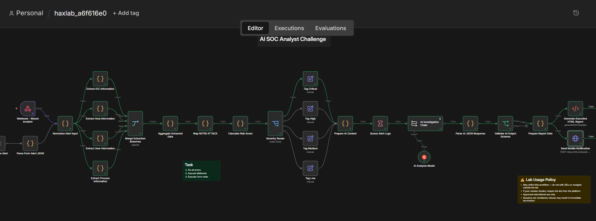

# Day 5: AI-Powered SOC: Workflow Investigation & Incident Response

**Topic:** AI-Powered SOC Automation
**Tools:** n8n (workflow automation), ntfy (mobile notifications)

## Scenario

Day 5 shifted from log analysis to **SOC automation**, investigating and repairing a broken n8n workflow built to auto-triage Wazuh alerts, then running that pipeline against real incidents end-to-end (webhook trigger, form submissions, AI-assisted investigation, MITRE mapping, risk scoring, and automated reporting/notification).

The challenge had three parts:
1. **Challenge 1: Workflow Investigation & Repair:** find and fix what a junior engineer broke before the pipeline could be trusted against live alerts.
2. **Challenge 2: Incident Analysis:** trigger a live alert (a "www-data" account executing "sudo" as root, reading a sensitive system file on "prod-webserver-01") and review the generated report.
3. **Challenge 3: Alert Validation:** manually submit two raw Wazuh alerts (a cron persistence mechanism and a failed SSH login) through the same pipeline and compare their reports.

## Questions & Answers

### Challenge 1: Workflow Investigation & Repair

### 1. Which node in the pipeline is currently disabled?
**Answer:** Normalize Alert Input, visibly marked "(Deactivated)" on the canvas.

### 2. Which branch of Validate AI Output Schema should be connected to Prepare Report Data?
**Answer:** true,  the schema validation node outputs 'true'/'false'; only a successfully validated AI response should be allowed to continue on to report generation.

### 3. Which node contains a URL with a placeholder that must be personalized before it will actually work?
**Answer:** Send Mobile Notification, its ntfy URL was set to "https://ntfy.sh/haxlab-{your-name}", with "{your-name}" as a literal placeholder that had to be replaced with an actual identifier before notifications would work.

### Challenge 2: Incident Analysis & Threat Investigation

### 4. What severity classification did the report assign to this incident?
**Answer:** Critical

### 5. Which MITRE ATT&CK technique ID is directly tied to the sudo privilege escalation?
**Answer:** T1548.003 (Sudo and Sudo Caching)

### 6. What verification code appears in your ntfy notification after a successful run?
**Answer:** HAX-SOC-2026, found by clicking the "Send Mobile Notification" node after the workflow ran successfully and checking its input schema. The browser tab title, meanwhile, was actually where the personalization identifier for the "{your-name}" URL placeholder needed to come from.

### 7. What is the source IP address that initiated this attack?
**Answer:** 185.220.101.47

### Challenge 3: Alert Validation & Response Assessment

### 8. How many IOCs did the workflow extract from Alert A (cron persistence)?
**Answer:** 2

### 9. What parent process is listed in your report's process chain from Alert A?
**Answer:** php-fpm, consistent with the raw alert data, where a PHP-FPM worker spawned a "bash" process that wrote the malicious cron entry, a classic web-shell-to-persistence pattern.

### 10. What parent process is listed in your report's process chain from Alert B?
**Answer:** systemd, expected, since "sshd" is normally spawned directly by systemd rather than through any application process.

### 11. What MITRE tactic is listed for Alert B (failed SSH login)?
**Answer:** Credential Access
