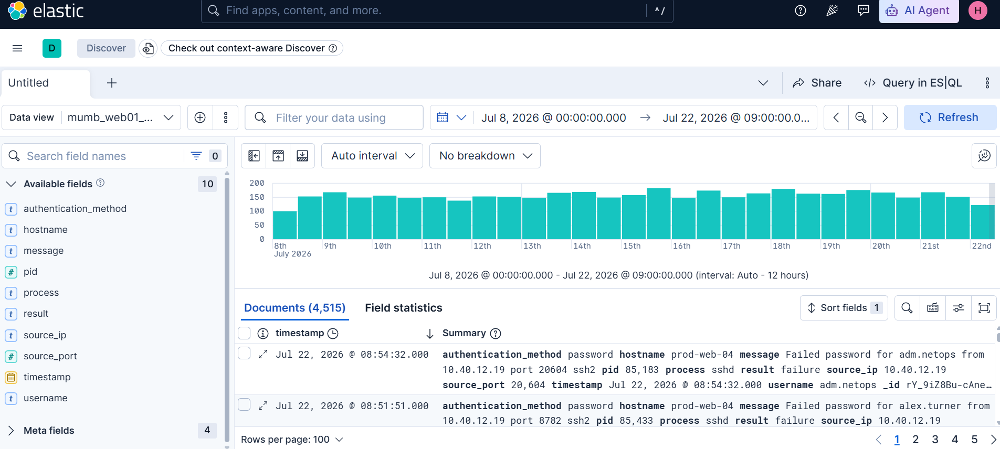
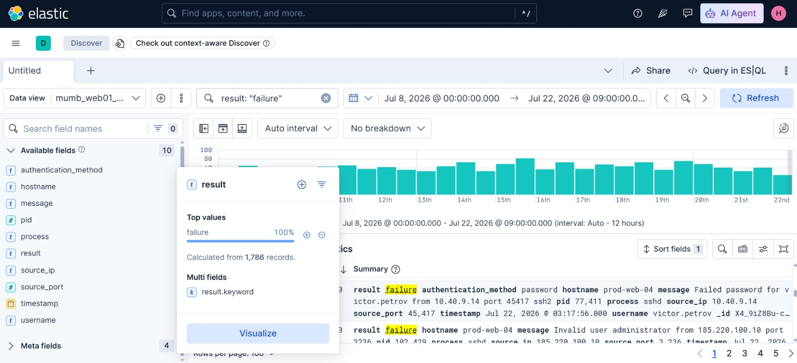
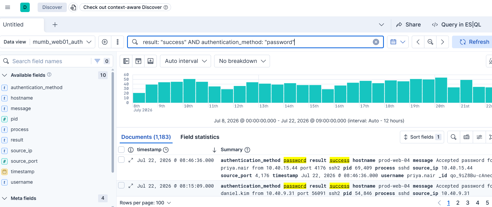
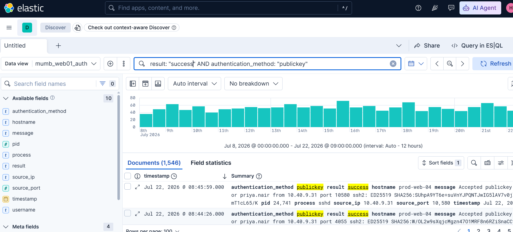
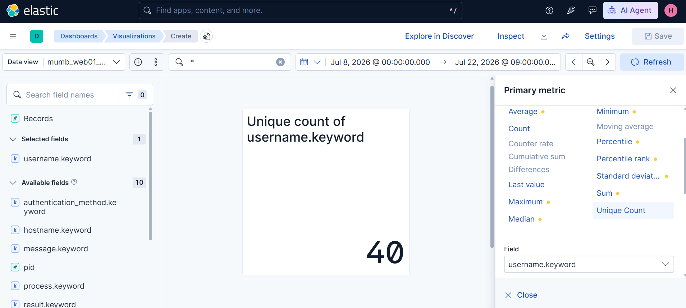
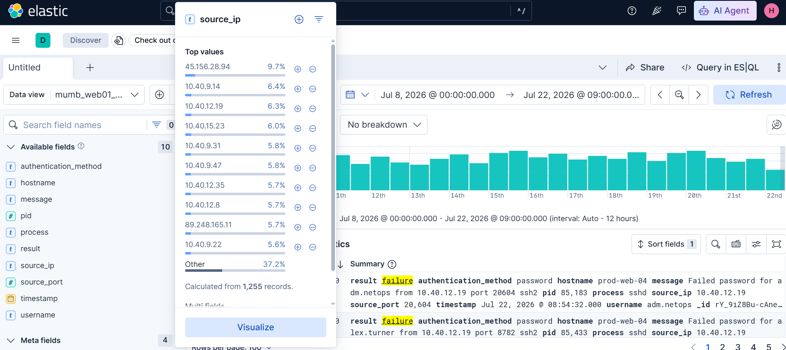
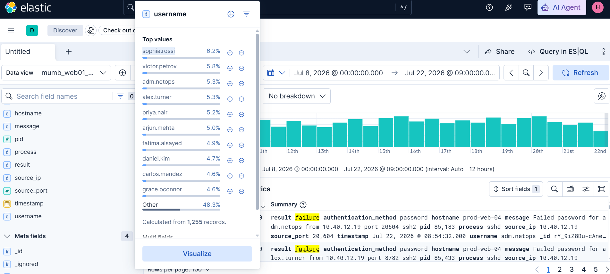

# Day 10: Elastic SIEM Masterclass

**Topic:** Elastic SIEM 
**Tools:** Elastic (Kibana Discover, Visualize)

## Scenario

Same underlying dataset family as earlier Splunk-based days ("mumb_web01_auth"), this time investigated through Elastic's Discover and Visualize tools instead. The task: quantify rejected authentication attempts, compare password vs. key-based successful logins, count unique account names, and spot the outlier IP and account behind the bulk of the rejections.



## Questions & Approach

### 1. How many authentication attempts against this server were rejected?

This question ended up taking far longer than it should have, and for a reason that had nothing to do with methodology.

**First attempt:** result: "failure" → 1786. Wrong.

**Investigated the hint** ("rejections come in more than one flavor") and confirmed there genuinely are two categories of failure event in this dataset:
- **"Invalid user"** rejections, no "authentication_method" field populated, since the account doesn't exist and the login never reaches the credential-check stage.
- **"Failed password"** rejections,  has "authentication_method: password", a real credential check that failed.

Tried isolating just the credential-check failures:
```
result: "failure" AND authentication_method: *
```
→ 1255. Still wrong.

Tried isolating just the invalid-user-only failures:
```
result: "failure" AND NOT authentication_method: *
```
→ 531. Still wrong.

Went back to the full combined count (1786) and even verified it with "result.keyword: "failure"" to rule out any text-analysis mismatch, same number both ways. Still rejected.



**Resolution:** after exhausting every reasonable field-based combination, I contacted the challenge creator directly. It turned out to be a genuine platform bug on their end, after a fix, the correct time range was actually 8 July to 23 July (not 22 July as originally specified), and re-running the simple query:
```
result: "failure"
```
against the corrected range returned:

**Answer: 1813**

[Screenshot: corrected time range + final query result]

### 2. Which method accounted for more successful logins, password or key-based?

```
result: "success" AND authentication_method: "password"
```


vs.
```
result: "success" AND authentication_method: "publickey"
```



**Answer:** publickey

### 3. How many distinct account names appear anywhere in this log?

the Discover's sampled "Top 9" sidebar popup only showed the top 9 usernames, so I built a proper Unique Count metric in Visualize on username.keyword, a single exact number instead of a partial/sampled bar chart.



**Answer: 40**

### 4. One IP shows up in rejected attempts far more than any real employee would. Which one?

```
result: "failure"
```
Looked in the top 9 source_ip



**Answer: 45.156.28.94**

### 5. One account was hit with rejected attempts far more than the rest. Which one?

filtered to "result: "failure"". Looked in top usernames.



**Answer: sophia.rossi**
