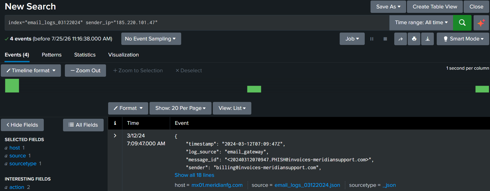
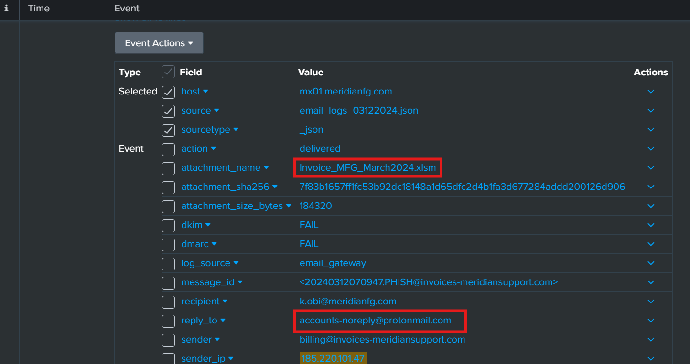

# Day 12: Email Incident Response Masterclass

**Topic:** Email Incident Response: investigating a phishing/invoice-fraud campaign via email gateway logs
**Tools:** Splunk

## Scenario

Given "index=email_logs_03122024", the SOC had already flagged malicious emails originating from "185.220.101.47" as part of a suspicious invoice campaign. The task was to confirm where a tricked victim's reply would actually route to (since sender and Reply-To addresses used different domains, a classic spoofing tell), and to identify the malicious attachment delivered as part of the campaign.

## Questions & Approach

### 1. After identifying malicious emails from 185.220.101.47, the SOC noticed that the sender and Reply-To addresses used different domains. Which mailbox would receive a victim’s reply?

```spl
index=email_logs_03122024 sender_ip="185.220.101.47"
```

A single expanded event gave everything needed at once. The sender field showed a spoofed-looking domain crafted to resemble a legitimate invoice/billing source:
```
sender: billing@invoices-meridiansupport.com
```

But the reply_to field pointed somewhere completely different:
```
reply_to: accounts-noreply@protonmail.com
```

**Answer: accounts-noreply@protonmail.com**

### 2. The suspicious invoice campaign from 185.220.101.47 delivered a macro-enabled Excel file. What was the attachment filename?

Same event:
```
attachment_name: Invoice_MFG_March2024.xlsm
```

**Answer: Invoice_MFG_March2024.xlsm**



