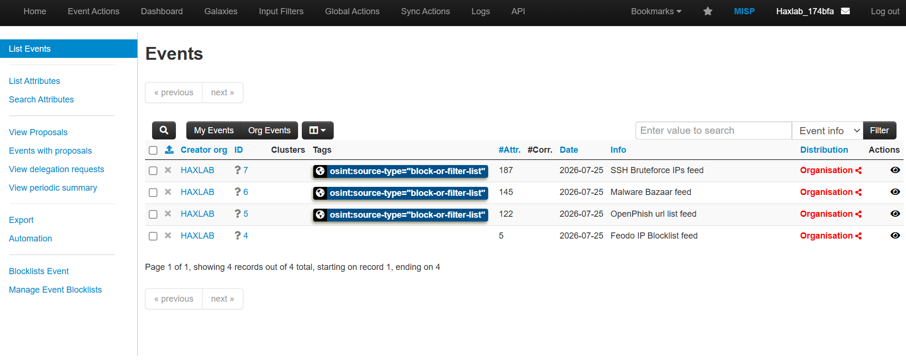
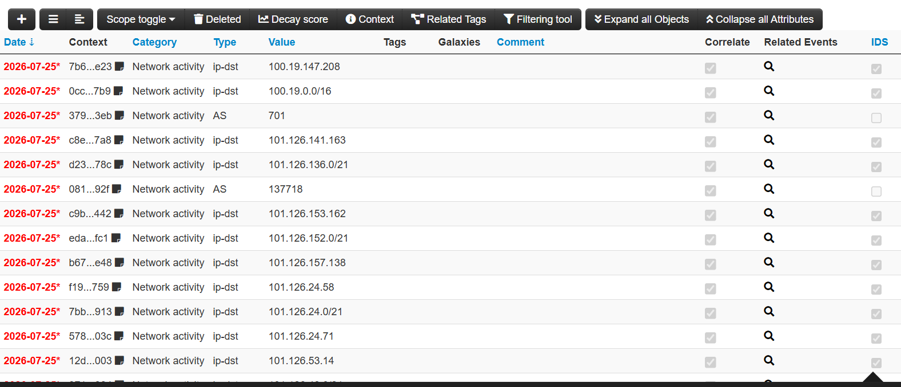
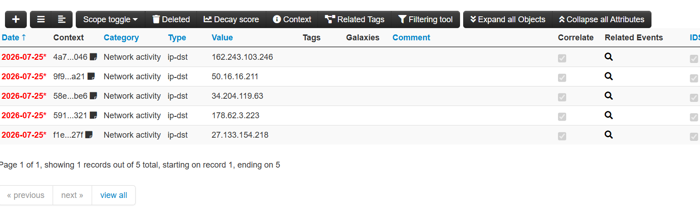
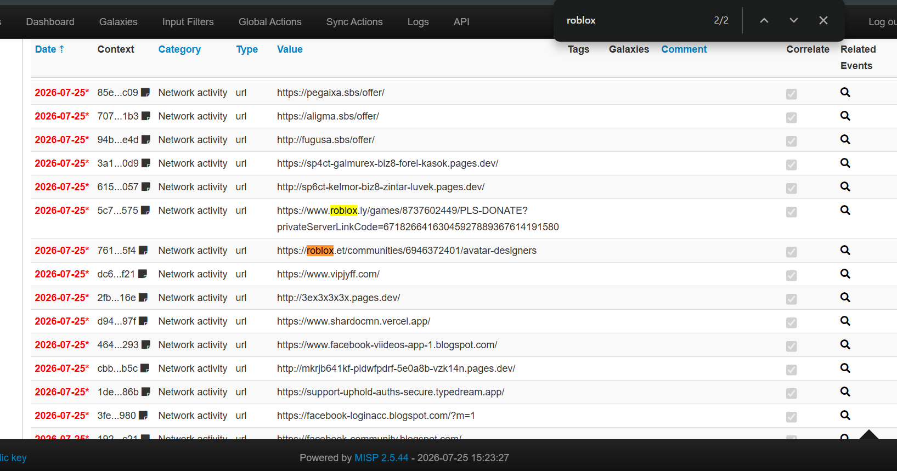
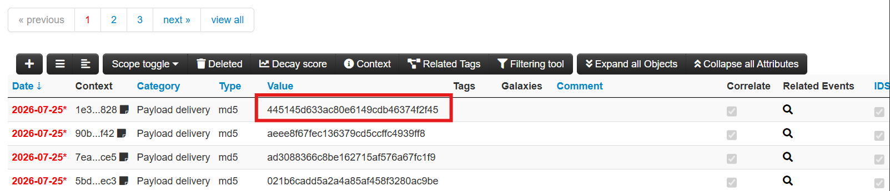

# Day 13: Threat Intelligence Crash Course

**Topic:** Threat Intelligence, reading structured IOC feeds in MISP
**Tools:** MISP (Malware Information Sharing Platform)

## Scenario

Given four pre-loaded MISP feed events: "SSH Bruteforce IPs feed," "Feodo IP Blocklist feed," "OpenPhish url list feed," and "Malware Bazaar feed", the task was to read through each event's attribute list and pull out specific IOC details: CIDR ranges, ASN ownership, blocklist size, a brand-impersonation phishing URL, and a malware hash.

## Questions & Approach

### 1. What CIDR network range contains the very first IP address listed in the "SSH Bruteforce IPs feed" event?

MISP groups related network attributes together in sequence, the first "ip-dst" attribute (100.19.147.208) was immediately followed by its associated CIDR attribute in the very next row.

**Answer: 100.19.0.0/16**

### 2. What ASN is linked to the brute-forcing IP 101.126.141.163?

Same event, same grouping pattern each "ip-dst" attribute is followed by its CIDR and then its "AS" (ASN) attribute as part of the same structured object.

**Answer: 137718**

### 3. How many IP addresses are listed in the "Feodo IP Blocklist feed" event?

**Answer: 5**

### 4. Which URL in the "OpenPhish url list feed" event appears to impersonate Roblox?

Scanned the URL list for a Roblox-lookalike domain, found a URL using a deliberately similar domain (roblox.ly instead of the real roblox.com) combined with a fake "PLS DONATE" game link:

**Answer:** "hxxps://www.roblox.ly/games/8737602449/PLS-DONATE?privateServerLinkCode=67182664163045927889367614191580"

### 5. What is the first MD5 hash listed in the "Malware Bazaar feed" event?

**Answer: 445145d633ac80e6149cdb46374f2f45**

