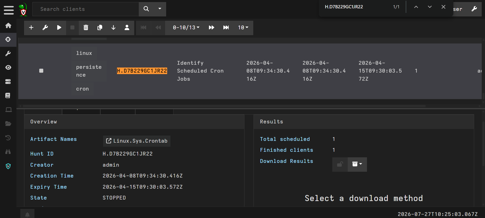
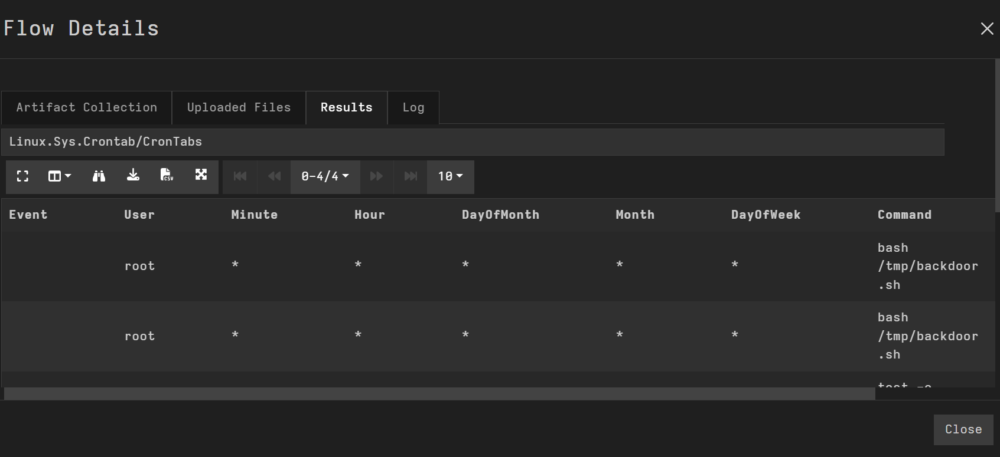
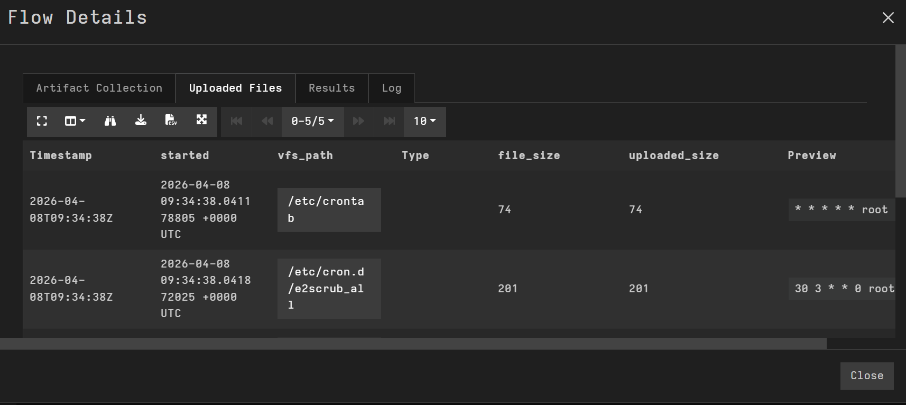
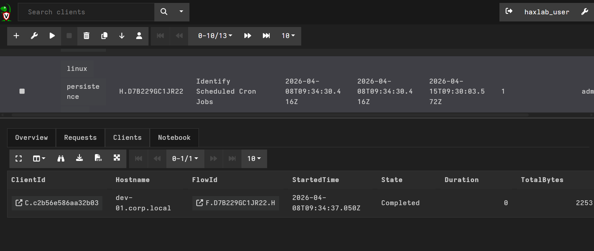

# Day 14: Threat Hunting Crash Course

**Topic:** Threat Hunting, endpoint artifact collection and cron persistence detection
**Tools:** Velociraptor (Hunt Manager, `Linux.Sys.Crontab` artifact)

## Scenario

Given a specific Hunt ID (H.D7B229GC1JR22) already run against an endpoint fleet, the task was to review its collected results, built on the Linux.Sys.Crontab artifact and identify a malicious cron-based persistence mechanism: which script it ran, which cron configuration file contained it, and which endpoint it was found on.

## Questions & Approach

### Understanding the artifact first

Before reading results, it helped to understand what Linux.Sys.Crontab actually collects. Its VQL definition runs three sub-queries:
- **CronTabs**: parses actual crontab entries from /etc/crontab, /etc/cron.d/, /var/spool/cron/crontabs/, etc., extracting the schedule fields (Minute/Hour/DayOfMonth/etc.), the executing User, and the Command itself.
- **CronScripts**: reads the content of script files sitting in /etc/cron.daily/, /etc/cron.hourly/, etc. (the actual executable scripts these cron directories run).
- **Uploaded**: uploads copies of both for offline analysis.

### 1. Which script is configured to execute from the suspicious cron entry?

In the **CronTabs** results table, most entries were legitimate scheduled maintenance (e2scrub_all, systemd/dpkg housekeeping commands under root), but two identical rows stood out immediately:

A cron entry set to run **every minute of every hour of every day**, executing a script sitting in /tmp/ (a world-writable, non-persistent directory that legitimate cron jobs almost never execute from) is about as clean a persistence red flag as it gets.

**Answer: backdoor.sh**

### 2. Which cron configuration file contains the malicious persistence?

The **Uploaded Files** table in Flow Detailes listed the legitimate script files found under /etc/cron.daily/ and /etc/cron.d/, each a normal, expected system maintenance script with an unremarkable size and hash. None of these were the backdoor entry, confirming the malicious line lives in the crontab configuration itself, not as a standalone script file in one of the cron directories.

Since /etc/crontab is the shared, single system-wide crontab file, and the malicious "/tmp/backdoor.sh" line was parsed as a scheduled command rather than appearing as a script file anywhere in the CronScripts listing, the persistence was configured directly inside:

**Answer: /etc/crontab**

### 3. What is the hostname of the endpoint where the malicious cron job was discovered?

Every result row tied to this hunt's Flow ID (F.D7B229GC1JR22.H) carried the same ClientId, confirming a single affected endpoint:

**Answer: dev-01.corp.local**

