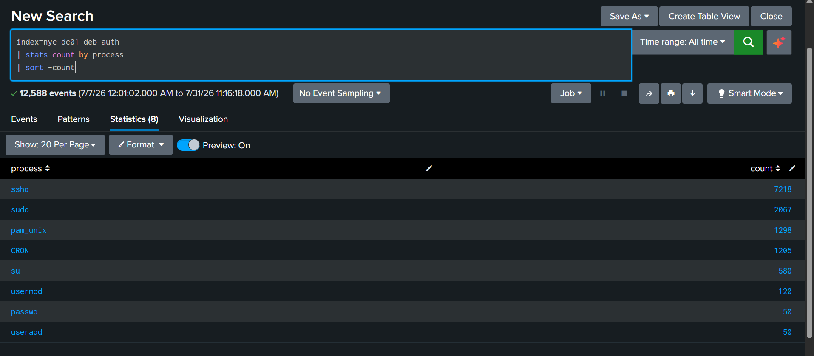
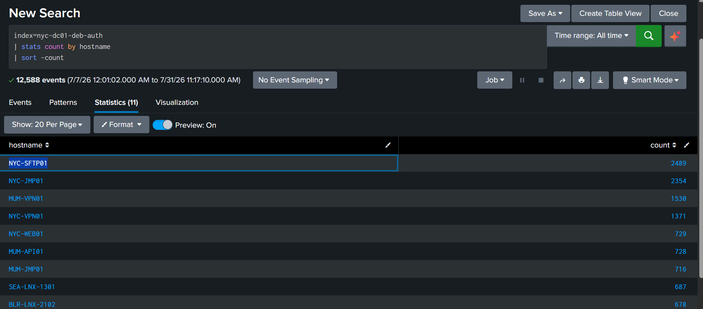
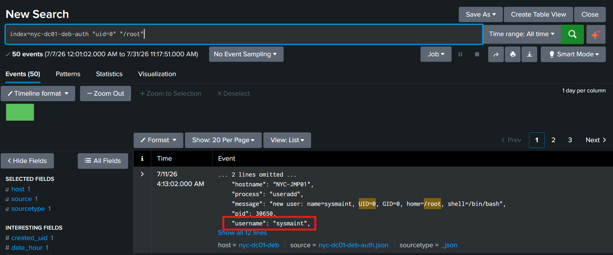
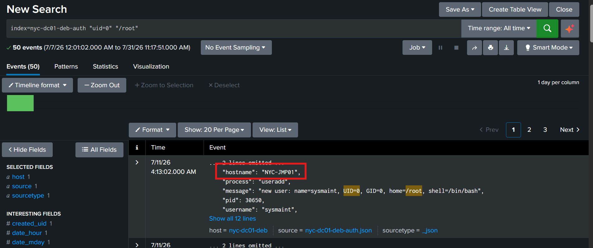

# Day 18: Linux Security Monitoring

**Topic:** Linux Security Monitoring 
**Tools:** Splunk

## Scenario

Following a credential attack, the SOC detected the creation of an unusual privileged account, which was later used for repeated SSH access from an external address. The task was to first get a baseline read on authentication activity volume (busiest process, busiest server) before pinpointing the actual backdoor account and where it was created.

## Questions & Approach

### Schema check

```spl
index=nyc-dc01-deb-auth
| head 5
```

Confirmed key fields: hostname (per-event, varies. the index-level host field is constant, same pattern seen in earlier Linux auth datasets this challenge), process, username, message, result.

### 1. Which process generated the highest number of authentication events?

```spl
index=nyc-dc01-deb-auth
| stats count by process
| sort -count
```

**Answer: sshd**



### 2. Which server generated the highest number of authentication events?

```spl
index=nyc-dc01-deb-auth
| stats count by hostname
| sort -count
```

**Answer: NYC-SFTP01** (2,489 events)



### 3. Which account was created with UID 0 and /root as its home directory?

```spl
index=nyc-dc01-deb-auth "uid=0" "/root"
```

Multiple matching useradd log entries, all identical in content:
```
new user: name=sysmaint, UID=0, GID=0, home=/root, shell=/bin/bash
```

**Answer: sysmaint**



UID 0 is the root account's UID, any additional account created with UID 0 is functionally a second root-equivalent account, regardless of its username. Combined with a /root-style home directory and a full interactive shell (/bin/bash), this is about as textbook a privileged backdoor account as it gets: a plausible-sounding, maintenance-flavored username (sysmaint) designed to blend in during a casual /etc/passwd review, while carrying full root privileges under the hood.

### 4. On which server was the privileged backdoor account created?

Every sysmaint account-creation event carried the same hostname value:

**Answer: NYC-JMP01**



This ties directly back to Question 2, NYC-JMP01 was already the second-busiest server by raw authentication volume, and it's also where the actual backdoor account got planted, consistent with the scenario's description of the account later being used for repeated external SSH access.
