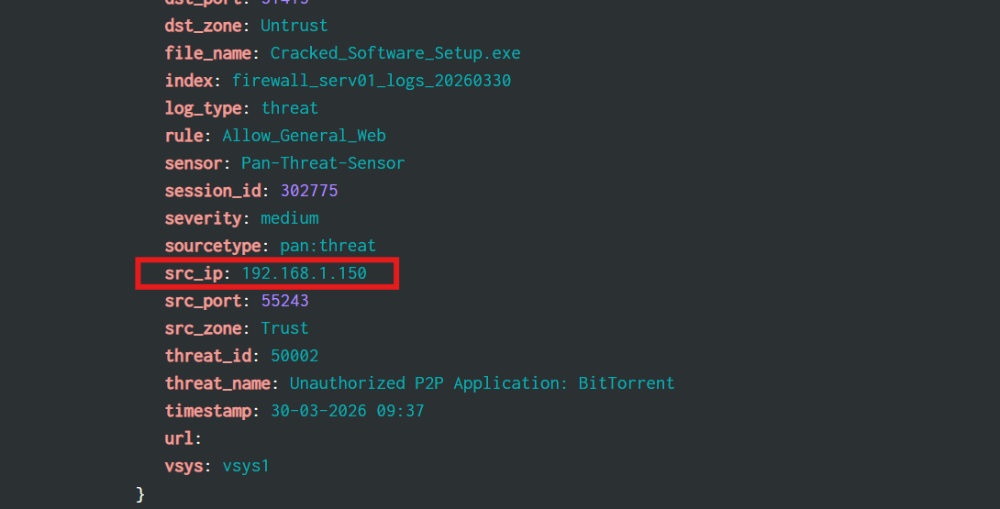
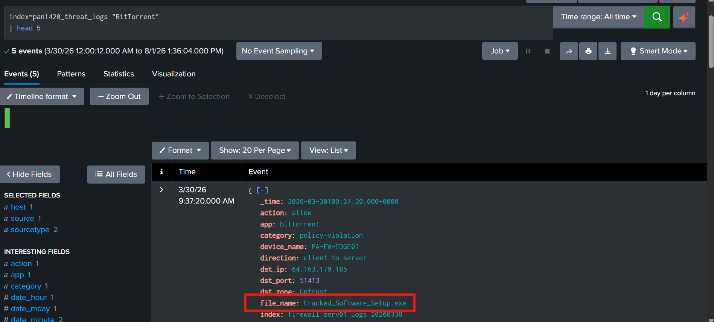
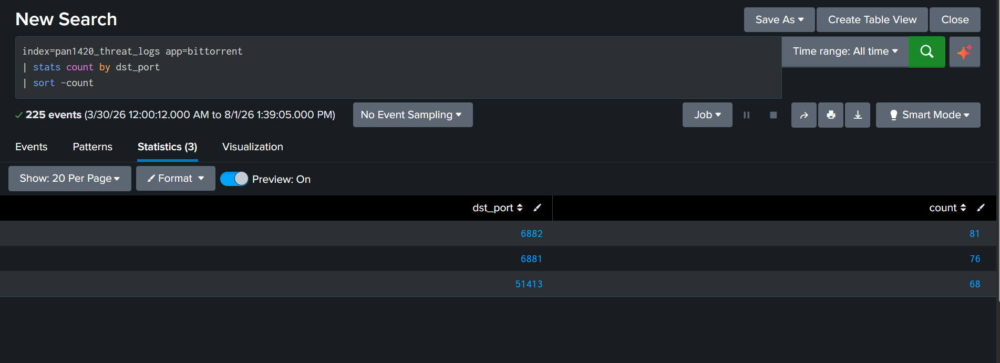

# Day 19: Network Security Monitoring 

**Tools:** Splunk

## Scenario

The SOC received a policy-violation alert after an internal endpoint established BitTorrent connections with numerous internet hosts. The task was to identify the responsible internal IP, the file associated with the P2P activity, and the most frequently used destination port across the traffic.

## Questions & Approach

### Schema check

```spl
index=pan1420_threat_logs "BitTorrent"
```

Palo Alto's pan:threat log format made this dataset straightforward, clean, flat fields with no nested JSON or nonstandard naming: src_ip, dst_ip, dst_port, file_name, app, threat_name, severity, all directly usable.

### 1. Which internal IP generated the BitTorrent traffic?

Every matching event carried the same source consistently:
```
src_ip: 192.168.1.150
```
**Answer: 192.168.1.150**



### 2. Which file was associated with the BitTorrent activity?

Also consistent across every event sampled:
```
file_name: Cracked_Software_Setup.exe
```

**Answer: Cracked_Software_Setup.exe**



### 3. Which destination port was used most frequently by the BitTorrent traffic?

```spl
index=pan1420_threat_logs app=bittorrent
| stats count by dst_port
| sort -count
```
**Answer: 6882**


