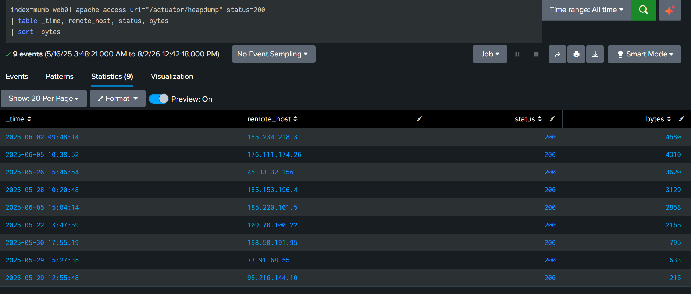
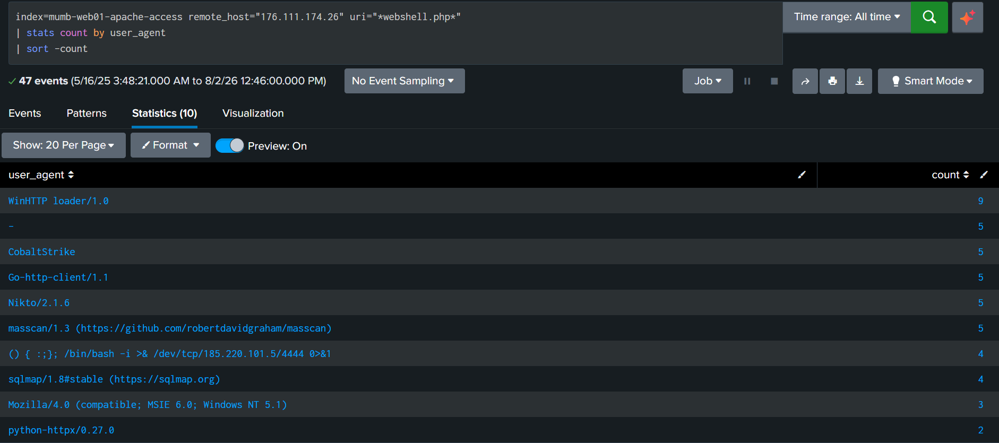

# Day 20: Application Security Monitoring

**Tools:** Splunk (Apache access logs)

## Scenario

TechCorp's SOC received an alert about repeated suspicious requests hitting SRV-WEB01.techcorp.local. The investigation needed to trace a full attack chain hidden inside Apache access logs: which external IP successfully exploited an exposed Spring Boot actuator endpoint, what tooling was used against a planted webshell, and which internal host(s) were later used to exfiltrate data to the attacker's C2 domain.

## Questions & Approach

### 1. Which source IP successfully accessed /actuator/heapdump?

```spl
index=mumb-web01-apache-access uri="/actuator/heapdump" status=200
| stats count by remote_host
| sort -count
```

Multiple IPs returned status=200 on this endpoint (a tie at 1 hit each) a genuine tie meant "successfully accessed" needed a more precise definition than just status code. Checked the actual response size for each 200-status hit, since a real heapdump download would return substantial data versus a trivial/near-empty response:

```spl
index=mumb-web01-apache-access uri="/actuator/heapdump" status=200
| table _time, remote_host, status, bytes
| sort -bytes
```

The largest response by far came from one IP, indicating a genuine successful data pull rather than an incidental 200.

**Answer: 185.234.218.3** (4,580 bytes, largest response among the tied 200-status hits)



### 2. Which user agent was used by source IP 176.111.174.26 to access webshell.php?

```spl
index=mumb-web01-apache-access remote_host="176.111.174.26" uri="*webshell.php*"
| stats count by user_agent
| sort -count
```

This IP showed an unusually wide spread of user agents hitting the same webshell command (?cmd=whoami) scanning/exploitation tools (Nikto, sqlmap, masscan), generic HTTP libraries (Go-http-client, python-httpx), a raw Shellshock exploit string, and legitimate-looking browser strings, alongside several hits explicitly labeled CobaltStrike.

**Answer: CobaltStrike**



This ties directly into Question 3: the C2 domain used later in the campaign is named cobalt-beacon-c2.ru. "cobalt-beacon" strongly signals Cobalt Strike, a legitimate red-team/penetration-testing framework that is also one of the most widely abused C2 platforms by real threat actors. When operators don't bother masking its default signature, Cobalt Strike's HTTP beacon traffic can literally show up with a CobaltStrike user agent string in web logs. The presence of so many other varied tool signatures against the same webshell also suggests either automated scanning/fuzzing noise unrelated to the main actor, or the same attacker cycling through multiple tools during reconnaissance and exploitation before settling into their actual C2 channel.

### 3. Which internal IP sent a POST request to cobalt-beacon-c2.ru?

```spl
index=mumb-web01-apache-access uri="*cobalt-beacon-c2.ru*" method=POST
| stats count by remote_host
| sort -count
```

This is where the investigation got genuinely difficult. A large number of internal (`10.10.x.x`) hosts all showed POST activity to the C2 domain's upload endpoint, this wasn't a single clean anomaly, but a wide spread of machines. I tried several approaches to narrow it to one IP:
- **Highest event count** by IP → 10.10.1.61 (4 events) = wrong.
- **Highest total bytes exfiltrated** by IP → still 10.10.1.61 (104MB total) = wrong.
- **Earliest chronological POST event** → 10.10.1.12 = wrong.

**I ended up brute-forcing this one** submitting different candidate IPs from the results list until the platform accepted one, since none of the standard aggregation approaches (frequency, byte volume, chronological order) pointed to the correct answer, and nothing visible in the raw log fields distinguished it from the rest.

**Answer: 10.10.2.50**

I still don't fully understand why this specific IP was the intended answer over the others showing the same or higher activity, my best guess is that the challenge may have an asset inventory or network segmentation reference (e.g., 10.10.2.x being a subnet where outbound traffic like this is a bigger anomaly than from a general workstation subnet) that wasn't visible anywhere in the Splunk data itself, but I wasn't able to confirm this.
