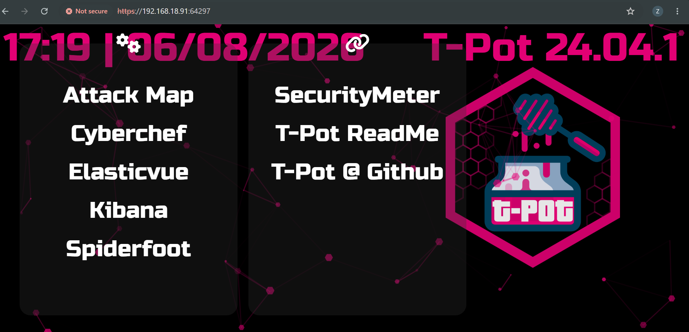

# Day 24: Capstone 1: Deploying a Honeypot with T-Pot

**Topic:** Honeypot Deployment 
**Tools:** VMware Workstation, Ubuntu Server 24.04, T-Pot (Docker-based honeypot suite)

## Scenario

Unlike the earlier log-analysis days, this capstone was a real hands-on infrastructure project: deploy T-Pot, a multi-honeypot platform that runs dozens of individual honeypot services (Cowrie, Dionaea, Honeytrap, and many more) alongside a full Elastic Stack for visualizing captured attacker activity, all inside Docker containers on a single dedicated VM.

## Questions

### 1. Which port is used to access the T-Pot web interface?

**Answer: 64297**

### 2. Which deployment type runs all T-Pot services on one machine?

**Answer: Standard / Hive**
